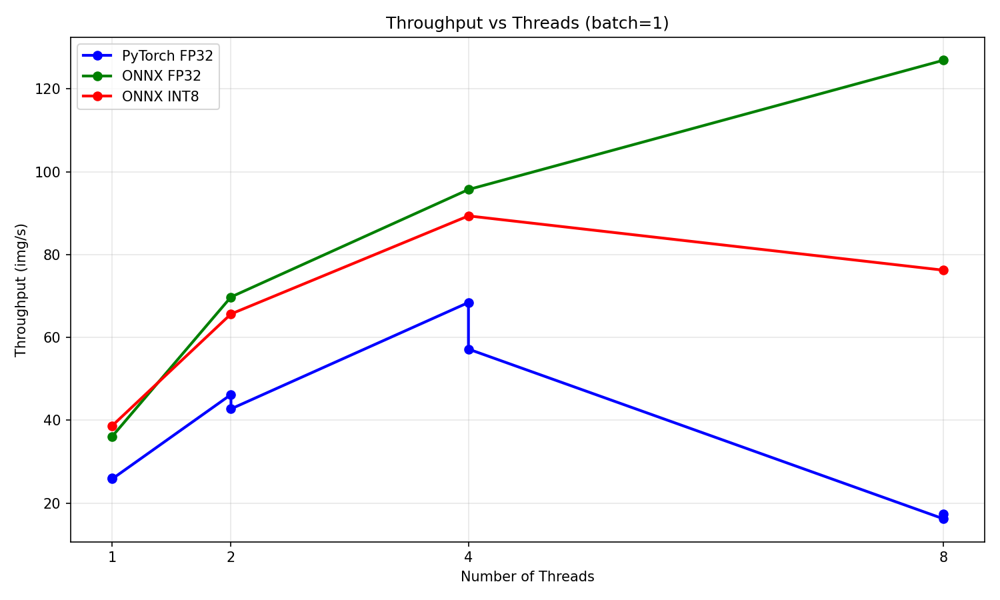
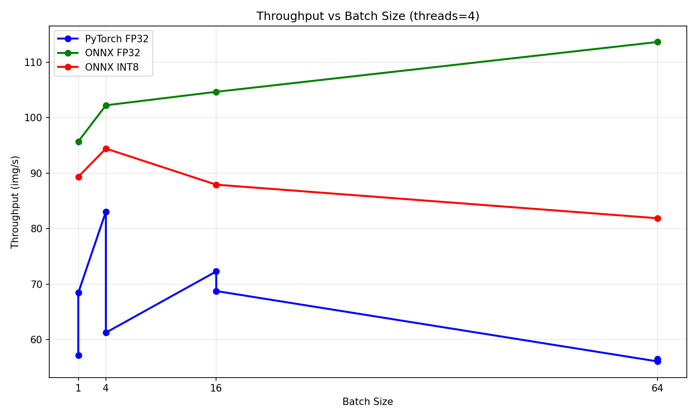
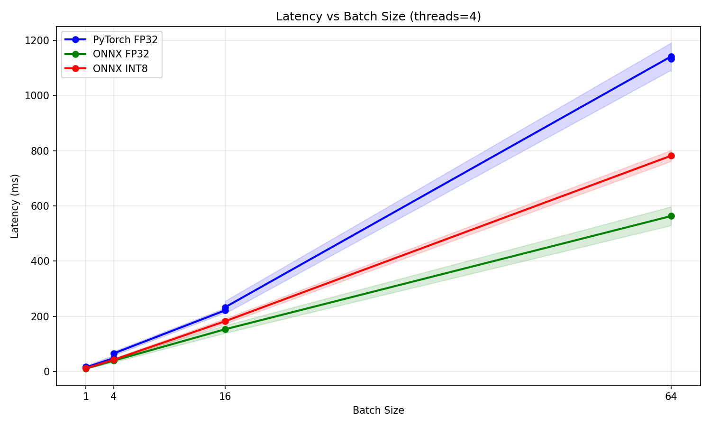
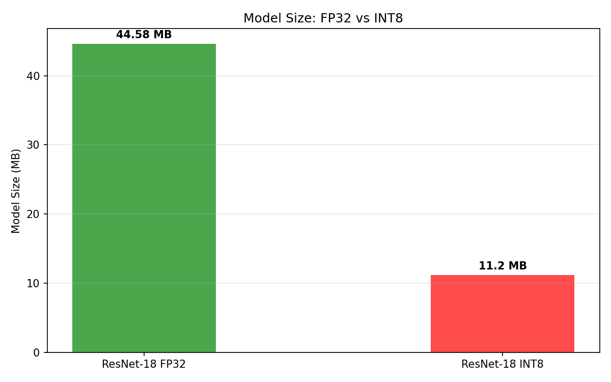

# AI Workload Benchmarking Mini-Suite

> Comparative inference performance study of ResNet-18 across PyTorch, ONNX Runtime FP32, and ONNX Runtime INT8 on x86 CPU — inspired by MLPerf Inference methodology.


## Motivation

Deploying neural networks efficiently on CPU-based systems requires understanding how different inference runtimes, precision formats, and hardware configurations affect performance. While frameworks like PyTorch are standard for training, production inference demands more careful evaluation of the full software stack.

This project benchmarks ResNet-18 inference across multiple runtimes and configurations, following MLPerf Inference methodology, to answer questions like:

- How much faster is ONNX Runtime compared to PyTorch eager mode?
- Does INT8 quantization improve performance on x86 CPU?
- What is the optimal thread count for CPU inference?
- How do latency and throughput trade off with batch size?

## Methodology

### Model
ResNet-18 pretrained on ImageNet (11M parameters, ~45MB). Exported from PyTorch to ONNX format using `torch.onnx.export()` with dynamic batch size support.

### Benchmarking approach
Inspired by MLPerf Inference:
- **Warmup:** 10 runs discarded before measurement
- **Measurement:** 100 runs per configuration
- **Reported metrics:** mean latency, std deviation, min/max, throughput

### Configurations tested
| Variable | Values |
|---|---|
| Runtime | PyTorch FP32, ONNX FP32, ONNX INT8 |
| Batch size | 1, 4, 16, 64 |
| Threads | 1, 2, 4, 8 |
| **Total** | **64 configurations** |

### Quantization
Dynamic INT8 quantization via `onnxruntime.quantization.quantize_dynamic()`. No calibration dataset required. Weights quantized to QUInt8, activations quantized at runtime.

### Hardware
- Platform: x86 CPU (Ubuntu 22.04, VirtualBox VM)
- 4 virtual cores
- No GPU


## Results

### Throughput vs Threads (batch=1)


### Throughput vs Batch Size (threads=4)


### Latency vs Batch Size (threads=4)


### Model Size: FP32 vs INT8


### Summary table (threads=4)

| Runtime | Batch | Latency (ms) | Throughput (img/s) |
|---|---|---|---|
| PyTorch FP32 | 1 | 17.5 | 57.2 |
| ONNX FP32 | 1 | 10.5 | 95.7 |
| ONNX INT8 | 1 | 11.2 | 89.3 |
| PyTorch FP32 | 64 | 1133 | 56.5 |
| ONNX FP32 | 64 | 563 | 113.6 |
| ONNX INT8 | 64 | 781 | 81.9 |


## Key Findings

- **ONNX Runtime FP32 is ~40% faster than PyTorch at batch=1** (10.5ms vs 17.5ms) due to operator fusion and zero Python overhead
- **ONNX Runtime FP32 is ~2x faster than PyTorch at batch=64** (563ms vs 1133ms) — the gap widens with larger batches
- **ONNX Runtime is the only runtime that consistently improves throughput with batch size** (95.7 → 113.6 img/s), demonstrating better CPU utilization
- **INT8 quantization achieves 4x model size reduction** (44.58MB → 11.20MB) with preserved Top-1 accuracy (class prediction unchanged)
- **INT8 is slower than FP32 on x86 CPU** due to conversion overhead — on AArch64 hardware with native INT8 SIMD instructions (e.g. Arm Neoverse V1) the result would be the opposite
- **Optimal thread count is 4** on this VM (matches physical core count) — PyTorch collapses at threads=8 (68.4 → 16.2 img/s) while ONNX Runtime continues scaling (126.9 img/s)
- **ONNX Runtime is more robust to thread misconfiguration**, making it safer for production deployment on multi-core systems


## How to Reproduce

### 1. Clone the repository
```bash
git clone https://github.com/Lucas-L12/ai-workload-benchmarking.git
cd ai-workload-benchmarking
```

### 2. Create virtual environment
```bash
python3 -m venv ~/.venvs/ai-bench
source ~/.venvs/ai-bench/bin/activate
pip install -r requirements.txt
```

### 3. Export ResNet-18 to ONNX
```bash
python src/export_onnx.py
```

### 4. Run benchmarks
```bash
python src/benchmark_pytorch.py
python src/benchmark_onnx.py
python src/quantize_int8.py
```

### 5. Generate plots
```bash
python analysis/plots.py
```

Results are saved to `results/` and plots to `analysis/plots/`.


## Project Structure

```
ai-workload-benchmarking/
│
├── src/
│   ├── export_onnx.py        # Load ResNet-18, export to ONNX, verify outputs
│   ├── benchmark_pytorch.py  # Benchmark PyTorch FP32 inference
│   ├── benchmark_onnx.py     # Benchmark ONNX Runtime FP32 inference
│   ├── quantize_int8.py      # INT8 quantization + benchmark
│   └── utils.py              # Shared latency measurement utility
│
├── models/
│   ├── resnet18.onnx         # Exported FP32 model
│   └── resnet18_int8.onnx    # Quantized INT8 model
│
├── results/
│   ├── benchmark_pytorch.csv
│   ├── benchmark_onnx.csv
│   └── benchmark_int8.csv
│
├── analysis/
│   ├── plots.py              # Generate all plots from CSV results
│   └── plots/                # Output plots (PNG)
│
├── requirements.txt
└── README.md
```
